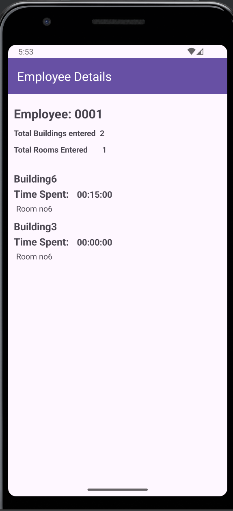

# TabaPay Security Logs App

## Introduction

The TabaPay Security Logs App is designed to efficiently manage employee check-in and check-out times within a secure facility. This repository contains the Android application along with its associated APIs for fetching and displaying employee security logs.

## Features

- **Employee Check-In/Check-Out**: Record and display employees' entry and exit times from the facility.
- **Employee List**: View a list of all employees currently registered in the system.
- **Building Logs**: Access detailed logs for each employee, showing their entry and exit times.


## Screenshots

    


## Getting Started
### Prerequisites
- Android Studio 2020.3.1 (Arctic Fox) or newer.
- Kotlin plugin installed.
- Min Android SDK version 24.

## Installation
 **1.Clone this repository:**

```
git clone https://github.com/simunde/tabapay-security-logs.git


 ```
**2.Open the project in Android Studio.**

**3.Sync Gradle and build the project.**
## Using the App
Ensure the app is properly connected to the API for fetching employee data. Utilize the app's functionality to manage employee check-ins, view employee lists, and access building logs.

# Sample App
The provided sample app demonstrates how to use the TabaPay Security Logs App. Explore the app to understand its integration and functionality in a real-world scenario.

### Running the Sample App
Open the project in Android Studio.

Select a device or emulator.

Run the application.


# Support
If you encounter any issues or have questions, please contact sidmundece17@gmail.com.

# Contributing
Contributions are welcome! Please read our Contributing Guide for more information on making pull requests.

# License
This project is licensed under the MIT License - see the LICENSE file for details.
